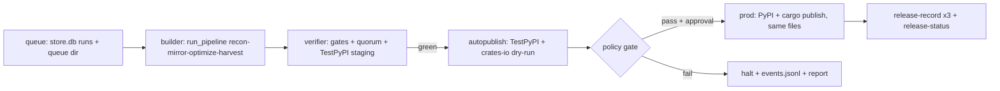

# Fire-and-Forget Rust Replica + Publish Pipeline — Proposal

Status: **proposal / not implemented**. For cross-LLM review, then final implementation.
Repo: `how-this-works` (rustsmith workspace). Date: 2026-10-02.

## 0. Goal

One command / daemon run that, given a list of source repos:

1. Produces a **working Rust replica** (behavior-identical mirror + bounded optimization), verified by **diverse models/providers** so no single model can grade its own work.
2. Publishes it as **two distributions from one implementation**:
   - Rust core crate → **crates.io** (e.g. `crc-rust-core`, pure Rust, no Python dep).
   - Python drop-in package → **PyPI** (e.g. `crc-rust`, `import crc` unchanged, PyO3 binding on same core).
3. Uses **TestPyPI as automatic staging**, PyPI + crates.io as production.
4. Requires **zero browser automation in steady state**. Browser (Playwright) only for one-time trusted-publisher bootstrap, if at all.

Non-goal: publishing rustsmith itself (stays a Cargo workspace binary).

## 1. Where we are today (ground truth)

- Pipeline: `Stage 0 Recon → Stage 1 Mirror → Stage 2 Optimize (rounds) → Stage 3 Harvest → release-prep`. Entry: `crates/rustsmith-cli/src/main.rs:27 main → run()/run_pipeline (:151)`, verbs `run / run-batch / recon / mirror / optimize / release-prep / release-record / release-status / learn`.
- Correctness core: `rustsmith-oracle` freezes tests+invocation into `oracle/manifest.json` (SHA-256, host-only). Only counted run is the **graded run** in a fresh `--network=none` container + host-only held-out suite. Pass bar for mirror: 100% oracle parity + identical count/skip + `visible − heldout` divergence `< 0.05` (`config/default.toml:[oracle]`).
- Gates: `rustsmith-gates/src/lib.rs` — pure Rust, no LLM: `oracle_integrity / oracle_parity / heldout_divergence / differential / unsafe_budget / miri / clippy` + optimizer gates (`workload_divergence / causal_attribution / benchmark / no_regression_widened / scope / provenance`). Gate failure fails the unit, never fatal by itself.
- Council: `rustsmith-council/src/lib.rs:93 SeatDriver::critique(seat, proposal, artifact)` — leakage is a type error. 4 seats `Architect/Verifier/Performance/Scope`, `config/default.toml:[models]` assigns distinct providers per seat, implementer never self-reviews, two reviewers on different providers, Architect tiebreak with justification. All decisions → `store.db: decisions`.
- Measurement: `rustsmith-profile/src/lib.rs` — deterministic median-of-7 screens, interleaved parent/candidate, noise floor measured, wall-clock 30-rep 95% CI confirms merged rounds only, `ceiling = share × (1 − 1/cap)`, dispatch only above `min_candidate_ceiling_pct`.
- Audit: `rustsmith-store/src/lib.rs` SQLite WAL `runs/units/gate_results/decisions/optimizations/failed_optimizations/rounds/guidance_revisions` + `events.jsonl`. `learn` aggregates cross-run yield → `guidance/optimize.md` diff, human `learn apply` only.
- Release today (`docs/RELEASE.md`, `crates/rustsmith-release/src/lib.rs`, `crates/rustsmith-cli/src/release.rs`):
  - Config: `mirror/<pkg>/release.toml` (`project / rust_crate / pypi_dist=<orig>-rust / python_import==project / version=X.Y.Z / requires_python / python_versions / platforms / github_repo / release_workflow / pypi+testpypi envs / license_spdx closed list / upstream attribution / smoke_exprs`). `mirror/crc` is the only release-ready example; `mirror/strsimpy` is flat-layout, refused by `validate_tree`.
  - `release-prep --project --fork [--opt] --recon-out --out`: stages clean copy (excludes `target/.git/venvs/dist/*.so`), `validate_names + validate_tree`, `cargo test` core, throwaway path-dep consumer `cargo build --offline` + `cargo package --allow-dirty --no-verify`, `maturin build + maturin sdist`, fresh venv `pip install --no-index` + dist-version + `smoke_exprs`, sdist unpack assert + rebuild. Retains `*.whl/*.tar.gz/*.crate + SHA256SUMS + release-manifest.json + verification.json + release-state.json (all pending) + release.yml + TRUSTED_PUBLISHING_SETUP.md`. **Zero uploads by design** — no `maturin publish / twine upload / cargo publish` call exists in Rust code; `cargo publish` appears only as a generated YAML string.
  - Generated `release.yml` lanes: `build (matrix os×py) → sdist → test-wheels (disk install+smoke, re-upload SAME files as tested-dist) → publish-testpypi (auto, trusted publishing, id-token:write) → verify-testpypi (index install+smoke) → release (manual only: workflow_dispatch + publish_production:true + pypi env reviewers → PyPI + cargo publish core)`.
  - Tracking: `release-record --state --registry testpypi|pypi|crates-io --result success|failed` appends attempts; `release-status` exits 0 + `complete` only on 3/3 success, else `partial/pending/failed`.
  - Containers `containers/run|grading.Dockerfile + wrapper.sh` are build/grade sandboxes only. `prompts/*` contain no publish instructions.

## 2. How PyPI / TestPyPI / crates.io publishing actually works

### 2.1 PyPI + TestPyPI (same protocol, two indices)

- Publish = file upload API: `twine upload dist/<pinned wheel+sdist>` or blessed `pypa/gh-action-pypi-publish@release/v1` consuming explicit retained files. `maturin publish` is out (combines build+publish, breaks same-file promotion; publishing commands deprecated upstream). Use `maturin build`/`sdist` only. TestPyPI = same action + `repository-url: https://test.pypi.org/legacy/`, install pinned `dist==version`.
- Auth:
  - (a) API token (`__token__` + `pypi-...`): works anywhere, long-lived, must be vaulted, rotation burden.
  - (b) Trusted Publishing OIDC (preferred, already generated): GH job with `permissions: id-token: write` mints a short-lived token (audience `pypi`, `testpypi` for TestPyPI). No stored secret; prefer the official publish action over hand-rolled mint-token exchange (exchange internals carry no compat guarantee). See `docs.pypi.org/trusted-publishers/using-a-publisher/`.
- One-time setup (per project, per index): register a **pending publisher** for NEW projects (existing projects use project settings) at `pypi.org/manage` + `test.pypi.org/manage`. Pending registration does NOT reserve the name. No documented/supported registration API — web UI only. This is the *only* step where browser automation (Playwright) is defensible, and only once. Decision for M-B: human checklist, not Playwright (see §3.4).
- Steady state must be API, never browser: Playwright-per-publish breaks on 2FA/CAPTCHA, selector rot, session expiry, speed, auditability.
- Practical rules: `pip install crc-rust` must still do `import crc` (`python_import == project`, `pypi_dist != project`); `twine check` before upload covers README rendering only, not behavior; upload ONLY wheel+sdist (never `.crate` — PyPI rejects it); `skip-existing:true` on TestPyPI is idempotent retry, NOT identity verification (same-name different-bytes must halt); always promote the SAME tested files, never rebuild between test and prod.

### 2.2 crates.io

- Publish = `cargo package --list` → `cargo publish --dry-run` (local check only, does NOT prove server-side acceptance) → `cargo publish --manifest-path <core>/Cargo.toml` (repackages source; does NOT consume the retained `.crate`). `release-prep` uses `cargo package --no-verify`, so its packaging check does not prove the packaged contents compile — verification must come from `cargo test` + consumer build + sdist rebuild proofs.
- Auth: FIRST publication of a NEW crate requires an API token (`cargo login`, short-lived, then remove). Subsequent GH publications use `rust-lang/crates-io-auth-action` (OIDC → `CARGO_REGISTRY_TOKEN=${{ steps.auth.outputs.token }}`); `id-token: write` alone does not authenticate `cargo publish`. Registration is per crate under its crates.io settings. Implemented in generated `release.yml` (core-first ordering).
- One-time link = browser/human (GitHub login to crates.io). Rest = headless.
- Rules that bite: names + versions immutable on crates.io (`yank` does not free them); PyPI differs (filenames immutable even after deletion, extra filenames allowed in a release) — do not treat the two as identical. Core-crate policy below is rustsmith policy, not registry law: Python-independent `rlib` with `src/lib.rs` (no `pyo3` in core — enforced by `validate_tree` substring check, not resolved-graph analysis), license + docs required. Order: publish `*-core` to crates.io **first**, verify remotely, then PyPI wheel (which vendors the same core via maturin). Versions must agree everywhere or `release-prep` refuses. Preflight `cargo search` / `pip index versions` are advisory only (search is fuzzy, index filters prereleases, either can race publication) — reconcile remote checksums after upload instead.

## 3. Proposed fire-and-forget system

### 3.1 Architecture

New crate: `rustsmith-publish` (pure orchestration) + `scripts/bootstrap_trusted_publishers.py` (one-shot Playwright) + vault/CI glue. Reuse `KNOWN_REGISTRIES`, `release-state.json`, `verification.json`, `events.jsonl`.

### 3.2 Multi-model replica guarantee (Stage 1–2 hardening)

Keep council shape, tighten diversity + quorum (config-enforced, not convention):

1. `worker` (provider-E) implements unit. `verifier` + one of `performance/scope` (providers MUST differ from worker and each other — refuse in `model_for_seat` otherwise) blind-review diff only.
2. Quorum 2/3 to merge; Architect tiebreak requires written justification, stored verbatim in `decisions`.
3. Add `differential_fuzz` gate beside `differential`: generated property cases run on orig vs port in grading container; any divergence = unit fail + feedback, 3 fails → `escalate_replan` (existing `Replan` enum).
4. Held-out magnitudes never enter prompts/logs (already redacted in `grade_candidate`); `learn` aggregates never see held-out values.
5. Privacy: `allow_training_tier_on_private_repos=false` stays code-enforced; training-tier models limited to `worker` seat.

### 3.3 Publisher (TestPyPI-auto, prod-gated) — IMPLEMENTED M-A/M-B hardening 2026-10-03

- `verifier` = existing `release-prep` 6 checks (must all pass) + `twine check` (rendering only).
- `autopublish (no human)`: upload ONLY retained wheel+sdist by explicit filename (never `dist/*` glob — excludes `.crate`) via official publish action / `twine upload --repository testpypi <files>` (vault token or CI OIDC) → fresh venv pinned `dist==version` install + `smoke_exprs` + version assert → `cargo publish --dry-run` advisory only. Record `testpypi` with remote file hashes; `success` sticky (late `failed` appends attempt, keeps success).
- `release-prep` guards (implemented): refuses `--out` overlapping project/fork/recon/opt; refuses `--out` holding `release-state.json` without `--force`; atomic tmp+fsync+rename writes; `store.create_run/create_unit` are `INSERT OR IGNORE` (no halt/status reset).
- `record_review` (implemented): rejects empty diffs, enforces `Resolution.approved()` — Reject blocks merge. `assign_reviewers` errors when distinct providers impossible. `parse_heldout_rate` fail-closed (`Err` on empty/unparsable, exit!=0 fails). `heldout_divergence` strict `<` + parity conjunct. `differential([])` rejected. Sandbox pytest host fallback requires `RUSTSMITH_ALLOW_HOST_FALLBACK=1`, otherwise refused.
- `policy gate (before prod)` — ALL must hold, else halt:
  - `verification.json.passed == true`, TestPyPI verify `< 24h` old, same SHA256 promoted (no rebuild).
  - Version preflight advisory only (`pip index versions` / `cargo search` fuzzy, can race); authoritative check is post-upload remote checksum reconciliation. Recovery after partial prod: accept existing remote release ONLY when filenames+hashes match approved artifacts, else halt.
  - `license_spdx ∈ KNOWN_SPDX`, `NOTICE` contains upstream + tag (substring only — not compliance proof; verify texts + dep obligations per artifact), `python_import == project`, `pypi_dist != normalize(project)`.
  - `unsafe_budget / miri / clippy / provenance` green on final `--opt` SHA (`source_sha` recorded, never guessed).
- `prod`: start as **manual** (`workflow_dispatch + pypi env reviewers`; note required reviewers need GH Team/Enterprise on private repos). Flip to auto only after 10 distinct manually-approved end-to-end releases/project over >=30d + recovery drills + owner auth. Prod uploads SAME `tested-dist` + `cargo publish` core (core FIRST, then PyPI). `release-record` per registry, `release-status` must read `complete`. Daemon dispatches/monitors CI OIDC; builder never holds registry creds; grading stays `--network=none`.
- Retries per-registry with backoff; never re-report finished registries; `partial` never reports `complete`. Each PyPI file reconciled individually; cargo timeout after upload does NOT mean unpublished — query before retry.

### 3.4 Bootstrap — DECISION M-B: human checklist, not Playwright

Review verdict: cut the Playwright bootstrap script. PyPI/crates.io registration is infrequent + human auth/recovery dominates; selector maintenance + session exposure not worth it. Automate GH repo/env via `gh`/REST API instead.

Checklist per project (from generated `TRUSTED_PUBLISHING_SETUP.md`):
1. `gh repo create <github_repo>` + push prepared tree + copy `release.yml` (`release_workflow` value does not rename output — prep always writes `release.yml`).
2. Human web: PyPI + TestPyPI pending publishers (new) or project publishers (existing; pending does NOT reserve names); crates.io FIRST publish via short-lived API token then per-crate trusted-publishing link (`rust-lang/crates-io-auth-action` thereafter).
3. GH `pypi`/`testpypi` envs + required reviewers (needs paid plan on private repos — verify, else public repo or alternate gate); pin actions + images; publisher creds off builder host.
4. Save redacted proof (workflow run IDs only — no cookies/traces/screenshots in artifacts). Daemon halts with setup URL on missing publisher, never retries login.

### 3.5 Secrets / CI

- Steady state: **no long-lived tokens in repo/CI**. Prefer OIDC on both indices + crates.io. Vault (env/1Password/GH secrets) only holds TestPyPI token for non-CI daemon runs + `CARGO_REGISTRY_TOKEN` fallback. `run_cmd(extra_env)` stays `&[]` in code; publisher injects env at runtime, never logs it (`add-mask`).
- Grading containers stay `--network=none`. Publisher runs on host/CI with network, never inside grading containers. `store.db`/heldout never mounted into run containers (existing invariant).

## 4. Rollout (revised per REWORK review)

- **M-A DONE 2026-10-03**: real reviews (`Resolution.approved()` enforced, empty diff refused, distinct-provider `Err`), isolated grading (host fallback opt-in only), fail-closed heldout (`Result`, exit!=0 fails, strict `<`), `differential([])` rejected, durable state (atomic writes, `--force` guard, sticky success, `INSERT OR IGNORE`), corrected workflow (valid `run:` smoke, `dtolnay`, parametrized core, reference-wheel test, pinned TestPyPI install, `crates-io-auth-action`, core-first, evidence upload). `run_pipeline` still ends at harvest; `release-prep` stays separate + offline-useful (no network preflight inside).
- **M-B NEXT**: one complete TestPyPI path on onboarded Python-spine projects. Fix scope done above; remaining: per-file remote-hash reconciliation after upload, crash-recovery drills (kill after upload before record, concurrent attempts, partial multi-wheel), workflow validation beyond string greps. NO Playwright, NO `learn`-on-publish-outcomes.
- **M-C LATER**: recoverable human-gated prod (core publish+verify, then PyPI promote, per-file record). Auto-prod only for explicitly authorized project + bounded change class after 10 distinct manually-approved end-to-end releases/project over >=30d + recovery drills + owner auth. New names/licensing/workflow/deps/unsafe/API changes return to human. “Auto behind required reviewers” is still human-gated — name the mode.
- Acceptance: `tests/release_acceptance.sh` extended with toolchain/auth/pin/evidence asserts (done); still needs workflow validation + live staging run (mock uploads insufficient for OIDC/wheels/registry rules).

## 5. Risks / non-goals

- Immutable public releases: wrong name/version/license cannot be undone — hence TestPyPI-first + policy gate + manual prod initially. Fully auto prod without human or quorum approval is explicitly out for M-A/M-B.
- Name squatting / typosquatting (`crc-rust` vs `crc`): `validate_names` + manual identity approval + normalized-name/ownership check; `pypi_dist` colliding with upstream refused. Preflight search advisory only.
- Supply chain: sdist must contain core + shim + NOTICE; rebuild-from-sdist proof required; publisher identity ≠ build/gate provenance (PyPI attestations prove upload identity, not gate passage); build in credential-free workers, publish from approved evidence only; `smoke_exprs`/envs/runner names interpolated into YAML — protect workflow + release policy from model edits, pin actions/images, serialize per project/version, bind approval to manifest digest. Provenance attestations (signed) deferred.
- Private-source disclosure: explicit public-distribution authorization before TestPyPI (private GH repo ≠ private TestPyPI/sdist). TestPyPI may be pruned — retain evidence independently, never treat it as ledger.
- Grading/publishing boundary: grading `--network=none`, no publisher creds/DB/writable audit exposed to candidate; deps prepped separately, candidate builds/tests run secret-free.

## 6. Open questions — ANSWERED per review

1. OIDC-only vs vaulted daemon token? CI OIDC standard; daemon dispatches/monitors. Narrow TestPyPI-token exception for non-CI runs allowed; first crate via short-lived token then remove. Tradeoff: CI latency for keeping authority off builder.
2. crates.io first or parallel? STRICT core-publish + remote verify first, then PyPI. Slower, predictable recovery. (Wheels vendor core, so ordering is policy.)
3. Quorum 2/3 vs consensus? Verifier+scope UNANIMITY for mirror correctness (third reviewer revises, never overrides correctness rejection); 2/3 for advisory perf choices. More cycles, stronger accountability; add provider quotas + bounded queues at 16 workers, fail-closed on outage.
4. Playwright vs checklist M-B? CHECKLIST + GH APIs. Less maintenance + exposure.
5. How many clean runs before auto prod? NO TestPyPI count suffices. Floor: 10 distinct manually-approved end-to-end releases/project over >=30d + recovery drills + independent final verification + owner auth. Count measures ops reliability, not correctness.
